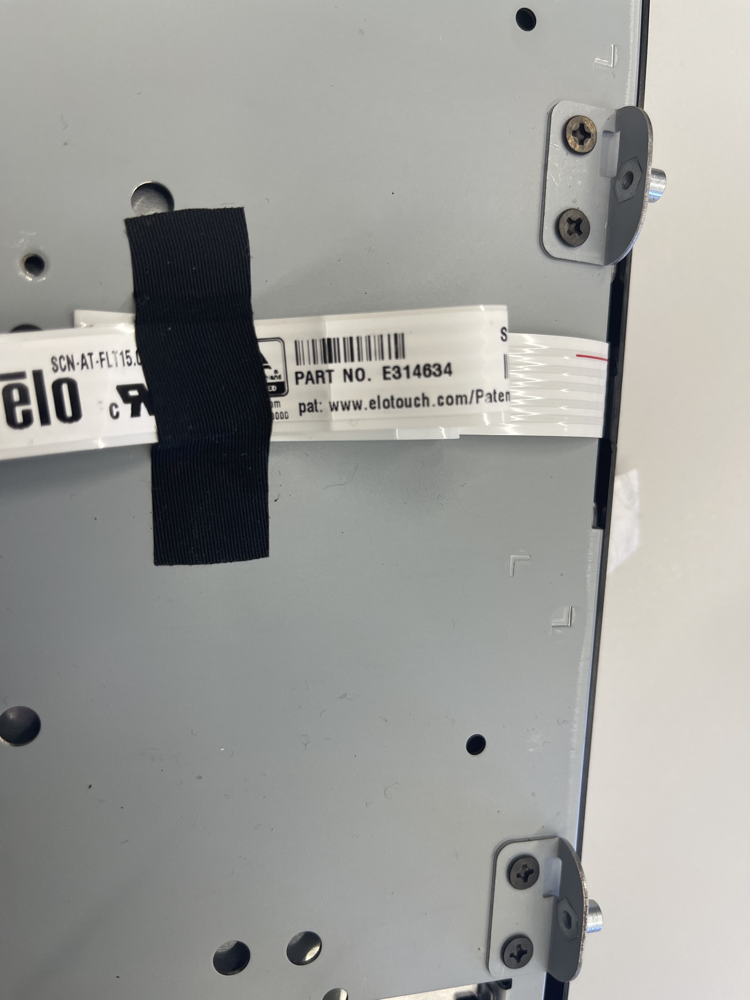
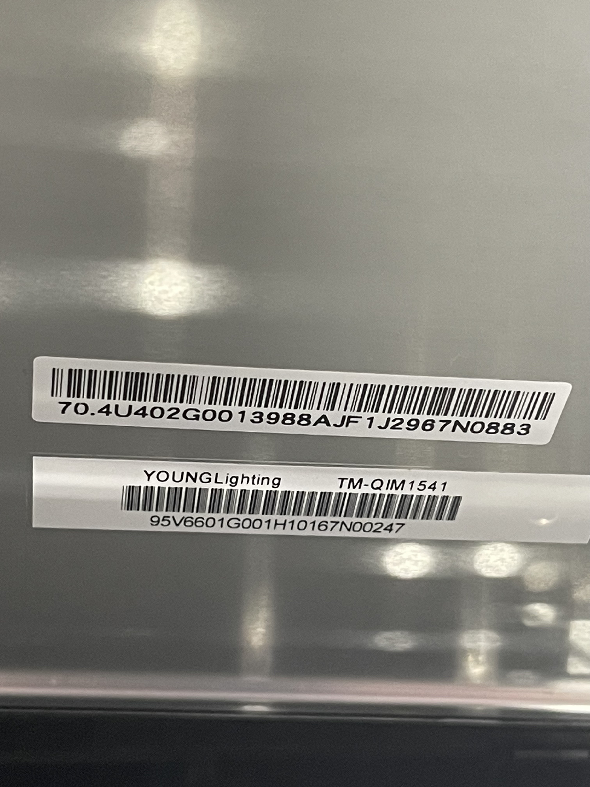

# Point Of Sale

This folder contains the code for the Point Of Sale (POS) system for the Cyber Range project.

This code is based on the Master copy of the code, and developed futher specifically for the POS system.

## POS Hardware

Still learning the hardware, but there are model numbers for the Screen and Touch Screen Components.

